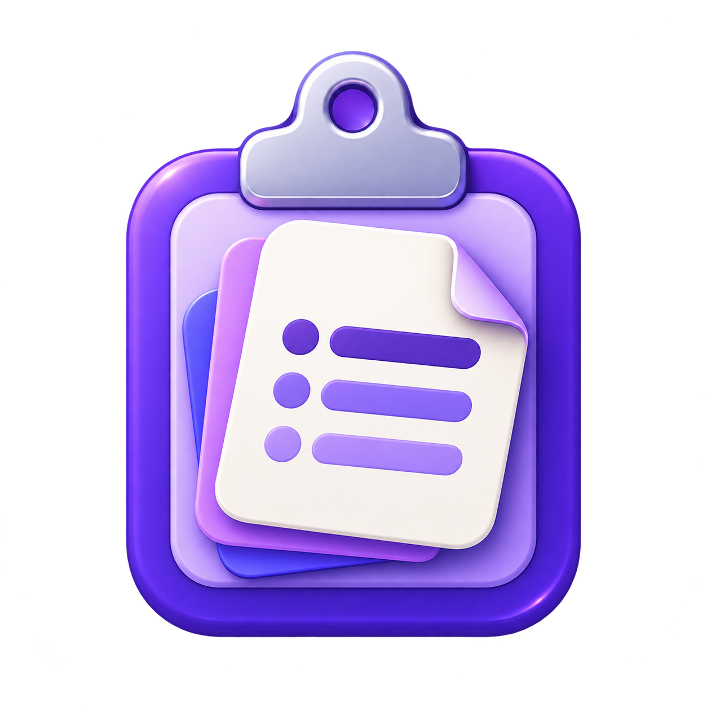

<p align="center">
  
</p>

<h1 align="center">Floating Clipboard — Downloads</h1>

<p align="center">
  <b>Your clipboard, supercharged.</b><br>
  A lightweight, privacy-first clipboard history manager for Windows 10 & 11.
</p>

<p align="center">
  
  
  
  
</p>

---

## ⬇️ Download

| Version | File | Size | Date |
|---------|------|------|------|
| **v1.0.0** (Latest) | [**Floating-Clipboard-Setup-1.0.0.exe**](https://github.com/Dev-SalamSheikh/floating-clipboard-downloads/raw/main/releases/Floating-Clipboard-Setup-1.0.0.exe) | ~54 MB | September 2026 |

> [!NOTE]
> This is a **self-contained installer** — no .NET runtime or any other dependency is required. Just download, install, and start using it.

---

## 🚀 Installation Guide

### Step 1 — Download
Click the download link above to get the latest installer (`.exe`).

### Step 2 — Handle Windows SmartScreen
Since the app is not yet code-signed, Windows SmartScreen may show a warning:

1. Click **"More info"** on the SmartScreen popup.
2. Click **"Run anyway"**.

> [!IMPORTANT]
> Only bypass SmartScreen when you've downloaded the installer **directly from this repository**. This is the official distribution channel.

### Step 3 — Install
1. Run the downloaded `.exe` file.
2. Follow the setup wizard — it takes about 10 seconds.
3. Choose your install location (default is recommended).

### Step 4 — Launch
- Open **Floating Clipboard** from the Start menu.
- The app appears as a small floating window you can drag anywhere.
- A system tray icon is also available for quick access.

### Step 5 — (Optional) Start with Windows
Go to **Settings** inside the app and enable **"Start with Windows"** so your clipboard history is always ready.

---

## ✨ What You Get

| Feature | Description |
|---------|-------------|
| 📋 **Clipboard History** | Automatically captures every text and image you copy |
| 🔍 **Instant Search** | Quickly find any past clipboard entry |
| 📌 **Pin Important Items** | Pin entries so they survive history clears |
| 🖱️ **One-Click Paste** | Click any entry to paste it into your last active app |
| 🪟 **Always-on-Top Window** | Draggable, resizable floating panel (min 170×170 px) |
| ⌨️ **Global Shortcut** | `Ctrl + Shift + V` to show/hide instantly |
| 🌗 **Light & Dark Themes** | Matches your preference |
| 🖼️ **Image Support** | Full image preview and paste-back |
| 🔒 **100% Offline** | No accounts, no cloud, no analytics — ever |
| 💾 **Persistent History** | Survives app restarts and reboots |

---

## 💻 System Requirements

| Requirement | Minimum |
|-------------|---------|
| **OS** | Windows 10 (version 1809+) or Windows 11 |
| **Architecture** | 64-bit (x64) Intel or AMD |
| **Disk Space** | ~120 MB after installation |
| **RAM** | Minimal — runs in background with negligible impact |
| **Dependencies** | None — fully self-contained |

---

## 🔐 Privacy & Data Storage

Floating Clipboard is **completely offline**. Your clipboard data never leaves your machine.

All data is stored locally at:
```
%LOCALAPPDATA%\Floating Clipboard\
├── settings.json      ← Your preferences
├── history.json       ← Clipboard history
└── images\            ← Saved image copies
```

> [!TIP]
> Delete sensitive entries when no longer needed, and use the **pause monitoring** option in Settings when handling confidential content.

---

## ❓ FAQ

<details>
<summary><b>Is this app really free?</b></summary>
<br>
Yes, Floating Clipboard is completely free with no ads, subscriptions, or in-app purchases.
</details>

<details>
<summary><b>Why does Windows SmartScreen warn me?</b></summary>
<br>
The installer is not yet code-signed with a Microsoft-trusted certificate. This is common for independent software. The app is safe to install when downloaded from this official repository.
</details>

<details>
<summary><b>Can I paste into elevated (admin) applications?</b></summary>
<br>
Windows blocks non-elevated apps from sending input to admin-elevated windows. To paste into admin apps, run Floating Clipboard as administrator too.
</details>

<details>
<summary><b>Does it work with images?</b></summary>
<br>
Yes! Floating Clipboard captures both text and images. Image paste-back depends on whether the destination app accepts bitmap data.
</details>

<details>
<summary><b>Where is my data stored?</b></summary>
<br>
Everything is stored locally in <code>%LOCALAPPDATA%\Floating Clipboard\</code>. Nothing is sent to any server.
</details>

<details>
<summary><b>How do I uninstall?</b></summary>
<br>
Use <b>Settings → Apps → Floating Clipboard → Uninstall</b> in Windows, or run the uninstaller from the installation directory.
</details>

---

## 🔗 Links

| | |
|---|---|
| 🌐 **Website** | [floatingclipboard.salamsheikh.com](https://floatingclipboard.salamsheikh.com) |
| 💻 **Source Code** | [github.com/Dev-SalamSheikh/floating-clipboard](https://github.com/Dev-SalamSheikh/floating-clipboard) |
| 🐛 **Report Issues** | [Open an issue](https://github.com/Dev-SalamSheikh/floating-clipboard/issues) |

---

## 📋 Changelog

### v1.0.0 — September 2026
- 🎉 Initial release
- Clipboard history for text and images
- Draggable, resizable always-on-top floating window
- Global `Ctrl + Shift + V` hotkey
- Search, pin, and delete entries
- Light and dark theme support
- System tray integration
- Configurable settings (startup, always-on-top, history size, and more)
- Self-contained Windows installer (no .NET required)

---

<p align="center">
  Made with ❤️ by <a href="https://github.com/Dev-SalamSheikh">Salam Sheikh</a>
</p>
