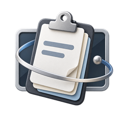

<p align="center">
  
</p>

<h1 align="center">FloatClip downloads</h1>

<p align="center">
  The official public installers for FloatClip, a private clipboard-history app for Windows 10 and Windows 11.
</p>

<p align="center">
  
  
  
</p>

## Download FloatClip 1.6.2

Choose the installer that matches your Windows computer:

| Computer | Recommended installer | Download size | Runtime |
| --- | --- | ---: | --- |
| Most Intel or AMD computers (64-bit) | [**FloatClip-Setup-1.6.2.exe**](releases/FloatClip-Setup-1.6.2.exe) | 51.97 MB | Included |
| Intel or AMD computer with .NET 10 already installed | [**FloatClip-Lite-Setup-1.6.2.exe**](releases/FloatClip-Lite-Setup-1.6.2.exe) | 5.74 MB | Requires x64 .NET 10 Desktop Runtime |
| 32-bit Windows computer | [**FloatClip-Setup-1.6.2-x86.exe**](releases/FloatClip-Setup-1.6.2-x86.exe) | 47.87 MB | Included |
| Windows on Arm computer | [**FloatClip-Setup-1.6.2-arm64.exe**](releases/FloatClip-Setup-1.6.2-arm64.exe) | 46.14 MB | Included |

If you are unsure, use **FloatClip-Setup-1.6.2.exe**. It is the full x64 installer used by most Windows PCs and does not require a separate .NET installation.

## Installation

1. Download the correct `.exe` file from the table above.
2. Exit FloatClip from its tray icon if an older version is running.
3. Open the installer and follow the setup wizard.
4. You can install the update over an existing FloatClip installation. Your locally stored clipboard history and settings are preserved.
5. Launch **FloatClip** from the Start menu.

FloatClip is not currently code-signed. Windows SmartScreen may show a warning. Only continue with **More info → Run anyway** when the installer came directly from this repository.

## What is included

- Searchable clipboard history that survives restarts
- Plain text, HTML, RTF, images, URLs, application links, and color previews
- One-click paste back into the previously focused application
- Folder tabs for organizing saved items
- Automatic masking for likely passwords and sensitive text
- Draggable, always-on-top window with resizing from every edge and corner
- Configurable idle fade, opacity, themes, history size, and startup behavior
- Local-only storage with no account, cloud sync, analytics, or telemetry

## System requirements

- A supported edition of Windows 10 or Windows 11
- Approximately 120 MB of free disk space for a full installation
- x64, x86, or Arm64 architecture matching the selected installer
- The Lite installer additionally requires the [x64 .NET 10 Desktop Runtime](https://dotnet.microsoft.com/download/dotnet/10.0)

Clipboard history and settings are stored locally under `%LOCALAPPDATA%\FloatClip`.

## Verify your download

Use PowerShell to calculate a checksum:

```powershell
Get-FileHash .\FloatClip-Setup-1.6.2.exe -Algorithm SHA256
```

| File | SHA-256 |
| --- | --- |
| `FloatClip-Setup-1.6.2.exe` | `C28E9F4CF916BC14C441D7262854091775A85D4D3737D336C2C6585CABB02C87` |
| `FloatClip-Lite-Setup-1.6.2.exe` | `FB57689AFCD5AB0E4374FBAAB05979343C024BF7BFE545152ACD37840C54D82A` |
| `FloatClip-Setup-1.6.2-x86.exe` | `DBEAE76535EF15696CD4729D6038DD9698B7573B4601BC273FA434ABE8A9BBE6` |
| `FloatClip-Setup-1.6.2-arm64.exe` | `9D8545DD5D270A92955C8AD78BC9D191B3B445F0C66674A7C0EEAB1F86EA8A59` |

## Related repositories

- [FloatClip source code](https://github.com/Dev-SalamSheikh/floating-clipboard)
- [FloatClip website](https://github.com/Dev-SalamSheikh/floating-clipboard-website)
- [Report an app issue](https://github.com/Dev-SalamSheikh/floating-clipboard/issues)

## Release notes

### 1.6.2

- Added invisible resizing from every window edge and corner
- Added folder tabs and move-to-folder item actions
- Added automatic masking for likely sensitive clipboard content
- Added rich clipboard previews, link actions, and color swatches
- Improved paste focus handling, smooth scrolling, hover states, theming, and settings controls
- Added persistent history, idle fade timing, and configurable faded opacity
- Updated FloatClip branding and multi-architecture installers

---

<p align="center">Official FloatClip distribution maintained by <a href="https://github.com/Dev-SalamSheikh">Dev-SalamSheikh</a>.</p>
